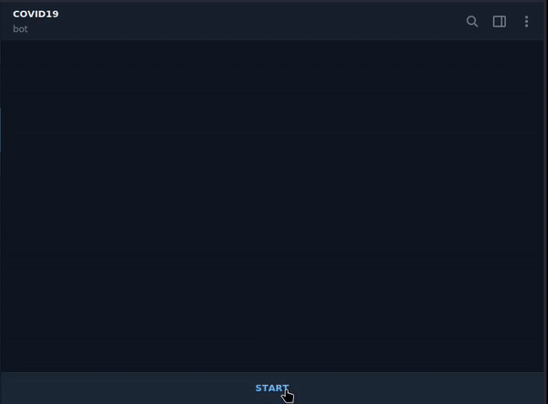

# COVID19 Telegram Bot  :robot:

COVID19 Telegram bot is a simple bot that shows status about current cases about covid19.

  - Show data by Country
  - Show data by State
  - Live data
  - Features like inline keyboard, Interactive command


 


# Used Modules & API
Modules:
  - Telegraf
  - Axios

API:
 - https://api.covid19india.org/data.json
 - https://bing.com/covid/data

### Installation

COVID19 requires [Node.js](https://nodejs.org/) v4+ to run.

Install the dependencies and devDependencies and start the server.

```sh
$ cd covid19-TelegramBOT
$ npm install
$ npm start
```

### Command

COVID19 currently supports this command. Instructions on how to use them are below.

| Command | Action |
| ------ | ------ |
| India | Get current data about India |
| By State | Get current data by state |
| Other Country | Get current data of other countries |
| Global | Get Total data |
| Bot info | Details about bot |
| Get Country List | Give the list of country that supported by API |
| /otherCountry <countryName> | Get Other country Data|


### Development

Want to contribute? Great!
Just fork the repository and create a pull request with your ideas.

License
----
**Free Software, Hell Yeah!**
